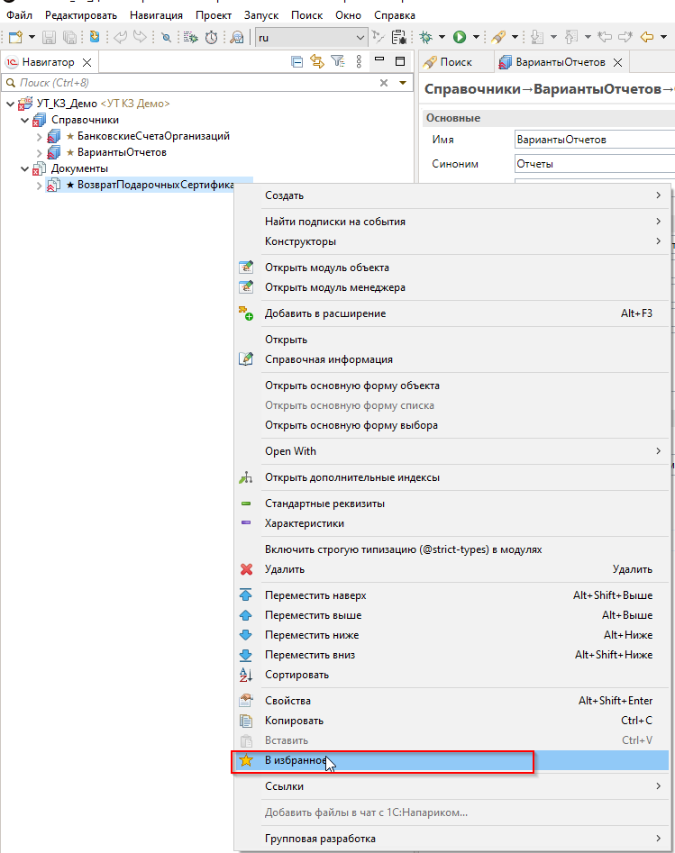
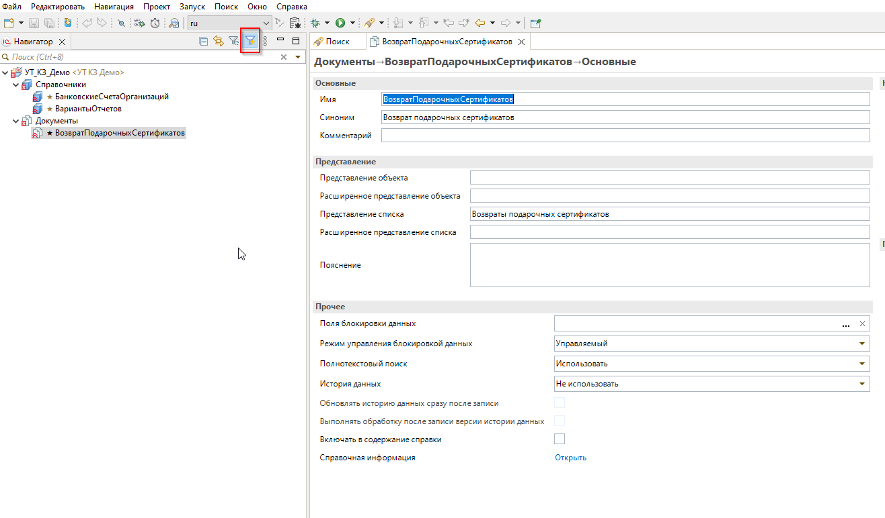
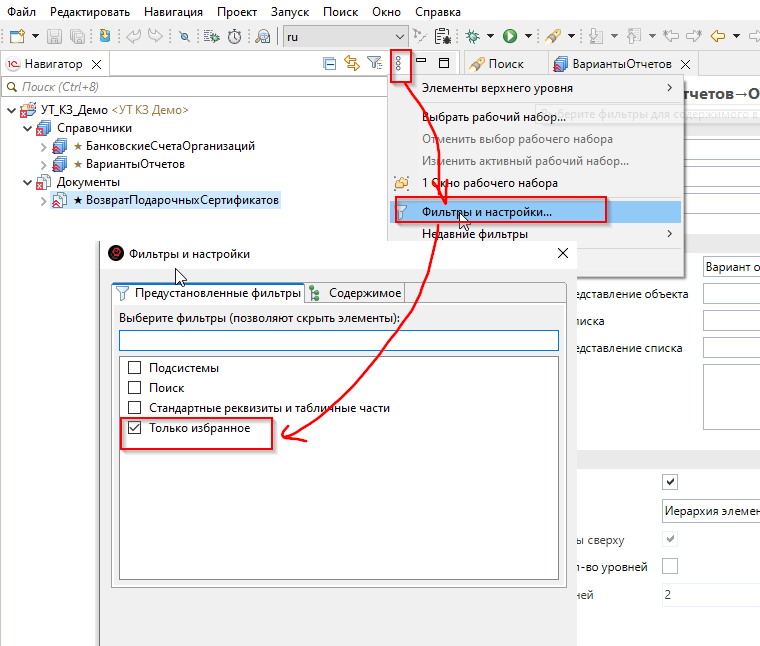

# EDT Favorites Plugin
Плагин для 1C:EDT, который позволяет отмечать объекты метаданных звёздочкой ★ и фильтровать дерево навигатора по избранным объектам.

## Возможности
- Отметить любой объект метаданных как избранный через контекстное меню
- Кнопка-фильтр на тулбаре навигатора — быстрое включение/выключение режима "Только избранное"
- Фильтр в настройках навигатора "Только избранное"
- Избранное сохраняется между сессиями

## Установка
### Через Eclipse Marketplace
1. В EDT откройте **Справка → Магазин Eclipse**
2. Найдите **EDT Favorites Plugin**
3. Нажмите **Install**

### Вручную
1. Скачайте JAR из раздела [Releases](https://github.com/Schinnikova/edt-favorites-plugin/releases)
2. Скопируйте в папку `dropins` вашего EDT: C:\Program Files\1C\1CE\components\1c-edt-2025.x.x+xxx-x86_64\dropins\
3. Перезапустите EDT

## Использование
**Добавить в избранное:** кликните правой кнопкой на объект в навигаторе → **В избранное**

**Быстрый фильтр:** нажмите кнопку ▽★ на тулбаре панели навигатора — серая звезда означает фильтр выключен, жёлтая — включён

**Фильтр через настройки:** нажмите кнопку фильтров → **Фильтры и настройки** → поставьте галочку **Только избранное**

## Скриншоты

## Требования
- 1C:EDT 2025.1 и выше
- Java 17

## Лицензия
MIT License